# Hospital Resilience Assessment - Technical Components Map

> A condensed, user-friendly mapping of all 127 assessment items organized by **functional domain** rather than phase/section.

---

## Quick Reference

| Domain | Items | Max Score |
|--------|-------|-----------|
| 🏛️ Governance & Leadership | 15 | 15 |
| 📋 Plans & Strategies | 22 | 22 |
| 🏗️ Infrastructure & Facilities | 20 | 20 |
| ⚙️ Systems & Technology | 18 | 18 |
| 📦 Supplies & Logistics | 20 | 20 |
| 👥 Human Resources | 24 | 24 |
| 🔄 Learning & Improvement | 8 | 8 |
| **TOTAL** | **127** | **127** |

---

## 🏛️ Governance & Leadership (15 items)

### Risk Assessment & Communication
| ID | Component | Phase |
|----|-----------|-------|
| 1.1.1 | Comprehensive hazard identification and risk assessment (HIRA) | Before |
| 1.1.2 | Risk assessment based on historical data & community vulnerability | Before |
| 1.1.3 | Documented risk profile (natural, tech, bio, societal hazards) | Before |
| 1.1.4 | Annual risk assessment updates | Before |
| 1.1.5 | Risk communication to leadership/departments | Before |
| 1.1.6 | Risk-informed strategic planning | Before |

### Organizational Structure
| ID | Component | Phase |
|----|-----------|-------|
| 1.3.1 | Multi-disciplinary disaster management committee | Before |
| 1.3.2 | Emergency management in accreditation standards | Before |
| 1.3.5 | Linkages with local emergency authorities | Before |
| 1.3.6 | Business continuity in development plans | Before |
| 1.7.1 | Emergency Preparedness Program (workplan, budget, personnel) | Before |
| 1.7.4 | Hospital Incident Management Team (HIMT) with defined roles | Before |
| 1.7.5 | Hospital Command Center/EOC established | Before |
| 2.2.4 | Command Center activation protocol | During |
| 2.2.5 | Internal/external coordination mechanisms | During |

---

## 📋 Plans & Strategies (22 items)

### Emergency Plans
| ID | Component | Phase |
|----|-----------|-------|
| 1.7.2 | Service Continuity Plan | Before |
| 1.7.3 | All-Hazards Emergency Response Plan | Before |
| 1.7.6 | Mass Casualty Management Plan | Before |
| 1.7.7 | Mass Fatality Management Plan | Before |
| 1.7.8 | Communicable Disease Outbreak Plan | Before |
| 1.7.9 | Evacuation Plan (tested) | Before |
| 1.7.10 | Integration with local/national emergency plans | Before |
| 1.7.11 | MOUs with partner hospitals | Before |
| 1.7.12 | Annual plan review cycle | Before |

### Response Protocols
| ID | Component | Phase |
|----|-----------|-------|
| 2.2.1 | All-Hazards Response Plan activation protocol | During |
| 2.2.2 | Hospital Incident Management activation criteria | During |
| 2.2.3 | Incident Action Planning (IAP) process | During |
| 2.2.6 | Patient surge protocols | During |
| 2.2.7 | Crisis standards of care protocols | During |
| 2.2.8 | Patient transfer/referral protocols | During |

### Recovery Strategies
| ID | Component | Phase |
|----|-----------|-------|
| 3.2.1 | Short-term recovery strategies | After |
| 3.2.2 | Stand-down of response operations protocol | After |
| 3.2.3 | Post-disaster recovery planning | After |
| 3.2.4 | Long-term reconstruction planning | After |
| 3.2.5 | Recovery phase security protocols | After |
| 3.2.6 | Emergency-to-routine transition | After |
| 3.2.7 | Build-back-better principles integration | After |

---

## 🏗️ Infrastructure & Facilities (20 items)

### Structural Safety
| ID | Component | Phase |
|----|-----------|-------|
| 1.2.1 | Hospital Safety Index (HSI) assessment completed | Before |
| 1.2.2 | Structural mitigation measures implemented | Before |
| 1.2.3 | Non-structural elements secured | Before |
| 1.2.4 | Accessibility standards compliance | Before |
| 1.2.5 | Critical infrastructure redundancy/backup | Before |
| 1.2.6 | Green/sustainable infrastructure | Before |
| 1.2.7 | Fire safety systems | Before |
| 1.2.8 | Evacuation routes marked and accessible | Before |

### Space Planning
| ID | Component | Phase |
|----|-----------|-------|
| 1.6.1 | Critical operational areas pre-identified | Before |
| 1.6.2 | Signage/color markings for mass casualty response | Before |
| 1.6.3 | Surge capacity spaces identified | Before |
| 1.6.4 | Step-down facilities identified | Before |
| 1.6.5 | Patient cohorting areas for outbreaks | Before |

### Space Response
| ID | Component | Phase |
|----|-----------|-------|
| 2.1.1 | Rapid structural damage assessment protocol | During |
| 2.1.2 | Hospital space repurposing protocol | During |
| 2.1.3 | IPC spatial arrangements implementable | During |
| 2.1.4 | Alternative care site activation protocol | During |

### Space Recovery
| ID | Component | Phase |
|----|-----------|-------|
| 3.1.1 | Facility damage and loss assessment protocol | After |
| 3.1.2 | Step-down facility utilization protocol | After |
| 3.1.3 | Facility rehabilitation and repair protocol | After |
| 3.1.4 | Return to normal operations (spaces) | After |

---

## ⚙️ Systems & Technology (18 items)

### Information Systems
| ID | Component | Phase |
|----|-----------|-------|
| 1.3.3 | Hospital Information Management System (HIMS) | Before |
| 2.3.5 | Situational awareness & information management | During |
| 2.3.6 | Patient tracking system | During |
| 3.3.1 | IT and medical records recovery protocols | After |

### Communication Systems
| ID | Component | Phase |
|----|-----------|-------|
| 1.3.4 | Risk communication & community engagement (RCCE) | Before |
| 1.8.2 | Risk communication protocols for various scenarios | Before |
| 1.8.3 | Early warning systems linked to operations | Before |
| 1.8.4 | Emergency communication systems (tested) | Before |
| 2.3.1 | Early warning monitoring protocols | During |
| 2.3.3 | Internal communication during response | During |
| 2.3.4 | External communication (media, public, authorities) | During |
| 3.3.5 | Recovery phase communication protocols | After |

### Clinical Systems
| ID | Component | Phase |
|----|-----------|-------|
| 1.3.7 | Routine emergency & support services documented | Before |
| 2.3.7 | Infection prevention and control implementable | During |
| 2.3.8 | Needs-based and risk-adjusted standards | During |
| 3.3.3 | Surveillance continuation during recovery | After |
| 3.3.4 | IPC measures during recovery | After |

### Community Engagement
| ID | Component | Phase |
|----|-----------|-------|
| 1.8.1 | Community engagement mechanisms | Before |
| 3.3.6 | Community engagement for recovery | After |

---

## 📦 Supplies & Logistics (20 items)

### Supply Chain Management
| ID | Component | Phase |
|----|-----------|-------|
| 1.4.1 | Preventive maintenance program | Before |
| 1.4.2 | Real-time inventory tracking system | Before |
| 1.4.3 | Emergency procurement logistics | Before |
| 1.4.5 | Centralized purchasing system | Before |
| 1.4.6 | Digital inventory (barcode/RFID) | Before |

### Financial Resources
| ID | Component | Phase |
|----|-----------|-------|
| 1.4.4 | Emergency financial reserves | Before |
| 1.9.5 | Emergency flexible finance mechanisms | Before |
| 3.4.3 | Cost mitigation strategies | After |
| 3.4.4 | Financial recovery & insurance claims | After |

### Emergency Stockpiles
| ID | Component | Phase |
|----|-----------|-------|
| 1.9.1 | Emergency stockpile of medicines/supplies | Before |
| 1.9.2 | Emergency supplies inventory management | Before |
| 1.9.3 | Emergency medicine/supplies procurement | Before |
| 1.9.4 | Vendor/service agreements for emergencies | Before |
| 1.9.6 | PPE stockpile maintained | Before |
| 1.9.7 | Emergency communication equipment | Before |
| 1.9.8 | Triage supplies stocked | Before |

### Response Resources
| ID | Component | Phase |
|----|-----------|-------|
| 2.3.2 | Rapid needs assessment protocol | During |
| 2.4.1 | Timely resource mobilization protocols | During |
| 2.4.2 | Emergency procurement protocols | During |
| 2.4.3 | Resource tracking & accountability | During |
| 2.4.4 | Pharmaceutical/medical supply surge protocols | During |
| 2.4.5 | Blood bank surge capacity protocols | During |
| 2.4.6 | Equipment sharing with partners | During |

### Recovery Resources
| ID | Component | Phase |
|----|-----------|-------|
| 3.4.1 | Inventory update & restocking protocol | After |
| 3.4.2 | Equipment repair & replacement protocol | After |

---

## 👥 Human Resources (24 items)

### Workforce Development
| ID | Component | Phase |
|----|-----------|-------|
| 1.3.8 | HEDRM in capacity development plans | Before |
| 1.5.1 | HEDRM in HR strategies | Before |
| 1.5.2 | Staff competency assessment for HEDRM | Before |
| 1.5.3 | HEDRM training programs | Before |
| 1.5.4 | HEDRM in job descriptions | Before |
| 1.5.5 | Staff contacts directory maintained | Before |
| 1.5.6 | HEDRM in new staff orientation | Before |

### Emergency Competencies
| ID | Component | Phase |
|----|-----------|-------|
| 1.10.1 | Emergency response competencies developed | Before |
| 1.10.2 | Regular training on response plans/roles | Before |
| 1.10.3 | HR mobilization system for emergencies | Before |
| 1.10.4 | Staff recall/call-tree system tested | Before |
| 1.10.7 | Just-in-time training resources available | Before |

### Volunteer & External Support
| ID | Component | Phase |
|----|-----------|-------|
| 1.10.5 | Volunteer management program | Before |
| 1.10.6 | Emergency Medical Teams coordination | Before |
| 2.5.5 | Volunteer integration protocols | During |
| 3.5.3 | Demobilization protocols (staff/volunteers) | After |

### Staff Safety & Wellbeing
| ID | Component | Phase |
|----|-----------|-------|
| 1.10.8 | Psychological first aid training | Before |
| 2.5.1 | Staff safety/security during response | During |
| 2.5.2 | Staff health monitoring during response | During |
| 2.5.3 | Staff welfare support (rest, meals, family) | During |
| 2.5.4 | Staff surge/augmentation protocols | During |
| 2.5.6 | Psychological support during response | During |
| 3.5.1 | MHPSS program for staff | After |
| 3.5.6 | Staff fatigue management in recovery | After |

### Recovery HR
| ID | Component | Phase |
|----|-----------|-------|
| 3.3.2 | Rehabilitation services protocols | After |
| 3.5.2 | Financial/non-financial incentives | After |
| 3.5.4 | Staff recognition program post-emergency | After |
| 3.5.5 | Return to normal staffing levels | After |

---

## 🔄 Learning & Improvement (8 items)

### Exercises & Drills
| ID | Component | Phase |
|----|-----------|-------|
| 1.8.5 | Regular drills and exercises (annual minimum) | Before |
| 1.8.6 | Variety of exercises (tabletop, functional, full-scale) | Before |

### After Action Review
| ID | Component | Phase |
|----|-----------|-------|
| 3.6.1 | After Action Review (AAR) process established | After |
| 3.6.2 | Background information collection for AAR | After |
| 3.6.3 | Trigger questions development | After |
| 3.6.4 | Identification of strengths, challenges, capacities | After |
| 3.6.5 | Consensus building among participants | After |
| 3.6.6 | AAR team debriefing process | After |
| 3.6.7 | AAR report writing & dissemination | After |
| 3.6.8 | Lessons learned with corrective action plan | After |
| 3.2.8 | Lessons incorporated into plan updates | After |

---

## 📊 Cross-Domain Dependencies

```mermaid
graph TB
    subgraph Foundation
        G[🏛️ Governance]
        P[📋 Plans]
    end
    
    subgraph Enablers
        I[🏗️ Infrastructure]
        S[⚙️ Systems]
        R[📦 Resources]
        H[👥 Human Resources]
    end
    
    subgraph Continuous
        L[🔄 Learning]
    end
    
    G --> P
    G --> H
    P --> I
    P --> S
    P --> R
    P --> H
    I --> S
    R --> S
    H --> L
    L --> G
    L --> P
```

---

## 🎯 Priority Categories

### Critical Foundation (must have for any response)
- Risk Assessment (1.1.1-1.1.3)
- All-Hazards ERP (1.7.3)
- HIMT & Command Center (1.7.4-1.7.5)
- Emergency Communication (1.8.4)
- Emergency Stockpiles (1.9.1, 1.9.6)

### Essential Operations (required for effective response)
- MCI Plan (1.7.6)
- Surge Protocols (2.2.6)
- Staff Training (1.10.1-1.10.2)
- Patient Tracking (2.3.6)
- Resource Mobilization (2.4.1-2.4.3)

### Enhanced Resilience (strengthens overall capacity)
- HSI Assessment (1.2.1)
- Partner MOUs (1.7.11)
- Community Engagement (1.3.4, 1.8.1)
- Build-Back-Better (3.2.7)
- AAR Process (3.6.1-3.6.8)

---

## 📈 Quick Assessment Tracker

| Domain | Critical (0-50%) | Developing (50-75%) | Advanced (75-100%) |
|--------|-----------------|---------------------|-------------------|
| 🏛️ Governance | ☐ | ☐ | ☐ |
| 📋 Plans | ☐ | ☐ | ☐ |
| 🏗️ Infrastructure | ☐ | ☐ | ☐ |
| ⚙️ Systems | ☐ | ☐ | ☐ |
| 📦 Supplies | ☐ | ☐ | ☐ |
| 👥 Staff | ☐ | ☐ | ☐ |
| 🔄 Learning | ☐ | ☐ | ☐ |

---

*Mapped from: Hospital Resilience Self-Assessment Tool (127 items)*  
*Original source: WHO Resilient Hospitals Guidance*
